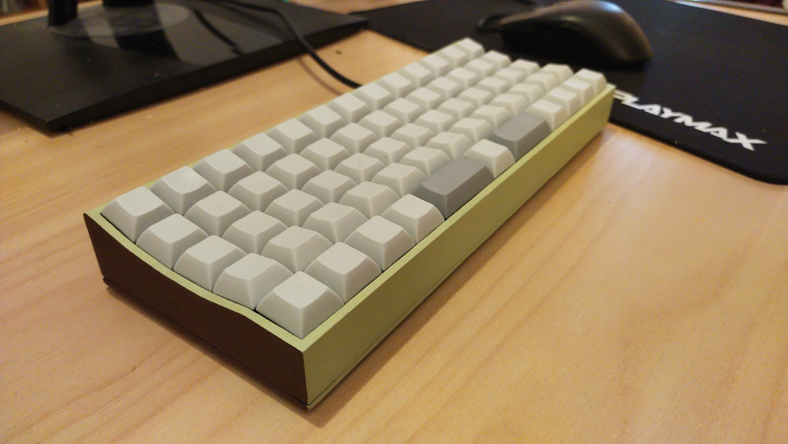

# Pistachio Keyboard

### What is this?
*Pistachio* is a 3D-printed, 63-key ortholinear keyboard that has been designed and built from scratch. It aims to be sublty ergonomic; being comfortable to use whilst keeping a minimalistic appearance. Its main features are that it is slightly curved, has a column of keys in the middle for easy-to-reach macros, and has a small spacebar key for each thumb. This keyboard has been designed to work with XDA keycaps, but other profiles may work as well. Being made in OpenSCAD, it is easy to configure aspects of the case to your liking. QMK is used for the firmware.

This repo contains .stl files which can be printed out to create the case for the keyboard.
It also contains the files QMK needs to get the firmware working once it’s all built. This allows the keyboard to type!

The OpenSCAD file is included, which is where the .stl is generated from. It’s easy to tweak parameters such as curve or row count to configure aspects of the keyboard. 

## Basic instructions
*A more detailed build guide that explains how I did each step will be coming soon.
*
### Building the keyboard
- 3D print all .stl files with a layer height of 0.15mm and adequate support.
- Glue the top and middle parts of the keyboard with epoxy so they become one solid whole.
- Sand, prime, paint and varnish to your liking.
- Laser cut bottom.svg. I cut it onto a sheet of 3mm bamboo, which worked well.
- Insert standard mechanical keyboard switches into the case.
- Wire up all the rows and columns using a guide such as this one (https://matt3o.com/hand-wiring-a-custom-keyboard/). Diodes should be connected column-to-row.
- At this point, it is a good idea to test the connections with a multimeter.
- Place the Pro Micro into the caddy, and hot glue it to the case.
- Solder the matrix to the Pro Micro as follows:

### Flashing the microcontroller
- Setup QMK: https://docs.qmk.fm/#/newbs_getting_started
- Move the *schertudi* directory to QMK's main directory of keyboards. On Linux this will default to ~/qmk_firmware/keyboards/.
- Set QMK’s default keyboard:
`qmk config user.keyboard=schertudi
`

- Now ensure it compiles:
`qmk compile
`

- If this works, the keyboard can be flashed. The Pro Micro must be reset by quickly shorting GND to RST twice in a row. Once it is reset we have a short window of time to write the new firmware to it:
`qmk flash
`

Once this is done, your brand new keyboard is ready to be used!

